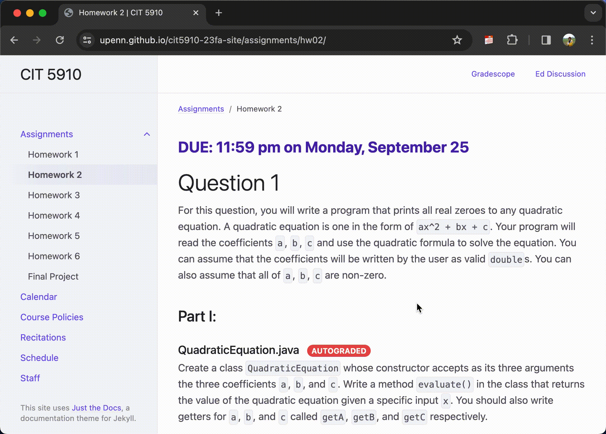

<!-- PROJECT LOGO -->
 

  

<h1 align="center">Task2Calendar</h1>

  

    A Chrome Extension helps clip assignment tasks from web pages to your calendars
  

<!-- ABOUT THE PROJECT -->
## About The Project

Task2Calendar is a lightweight Chrome Extension tailored especially for UPenn MCIT students to clip assignment tasks from webpages directly to their calendars with a single click.

It won second place in UPenn MCIT Hackathon 2024 themed in productivity-boosting. 🏆

#### Developers
👩🏻‍💻 [@zairuiy-coding] (https://www.github.com/zairuiy-coding)
👩🏻‍💻 [@tanhaow] (https://www.github.com/tanhaow)

#### Built With

[![JavaScript][JavaScript]][JavaScript-url] [![HTML][HTML]][HTML-url] [![CSS][CSS]][CSS-url]

## Easy to Use

#### ⚡️ Light - No need to deploy

  
  

  <figcaption style="text-align:center"><em>Usage: open Google Chrome -> go to Extension -> click Load Unpacked -> selection Task2Calendar.</em></figcaption>

 

#### 🙌 Simple - Boost your productivity

  
  

  <figcaption style="text-align:center"><em>Task2Calendar helps clip assignment from course webpage.</em></figcaption>

 

  
  

  <figcaption style="text-align:center"><em>Task2Calendar works with multiple types of webpage.</em></figcaption>

 

  
  

  <figcaption style="text-align:center"><em>When it comes to certain case that task name and due date aare not displayed on a single page, Task2Calendar allows the flexibility for user to add info manually.</em></figcaption>

 

#### 🌊 Fast - Calendar automation

  
  

  <figcaption style="text-align:center"><em>Export all tasks to your calender (.ics) with a simple click.</em></figcaption>

 

(<a href="#readme-top">back to top</a>)

<!-- Inspiration -->
## Inspiration
This project was inspired by the famous academic tool [Zotero](https://github.com/zotero/zotero).

🎖️ Zotero --> clip academic research into your bibliography 📄

🎖️ Task2Calendar --> clip academic assignments into your calendar 📆

(<a href="#readme-top">back to top</a>)

<!-- MARKDOWN LINKS & IMAGES -->
[JavaScript]: https://img.shields.io/badge/JavaScript-F7DF1E?style=for-the-badge&logo=JavaScript&logoColor=white
[JavaScript-url]: https://www.javascript.com/
[HTML]: https://img.shields.io/badge/html5-E34F26?style=for-the-badge&logo=html5&logoColor=white
[HTML-url]: https://html.com/
[CSS]: https://img.shields.io/badge/css3-1572B6?style=for-the-badge&logo=css3&logoColor=white
[CSS-url]: https://css3.com/
