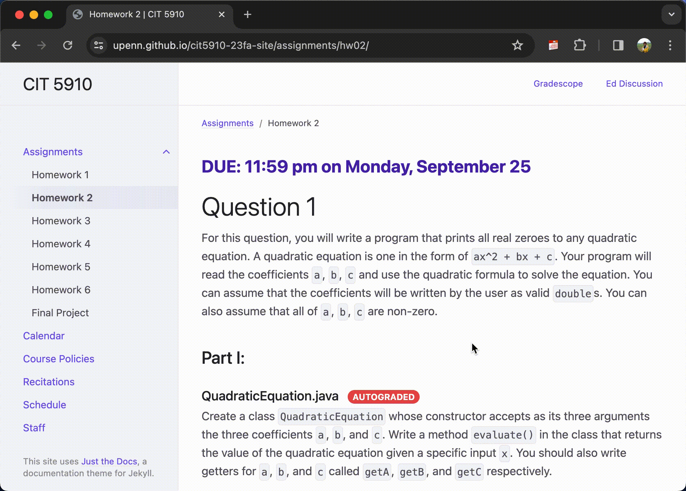
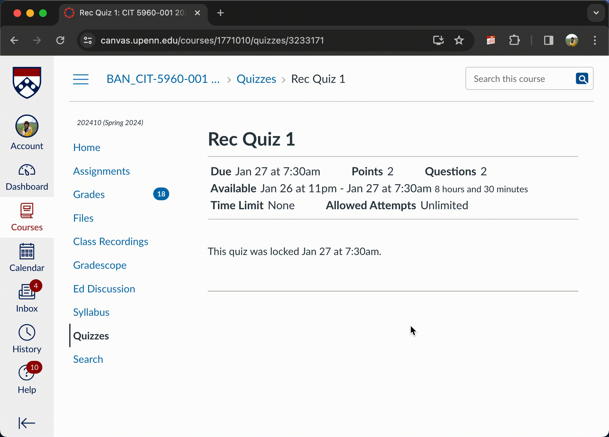
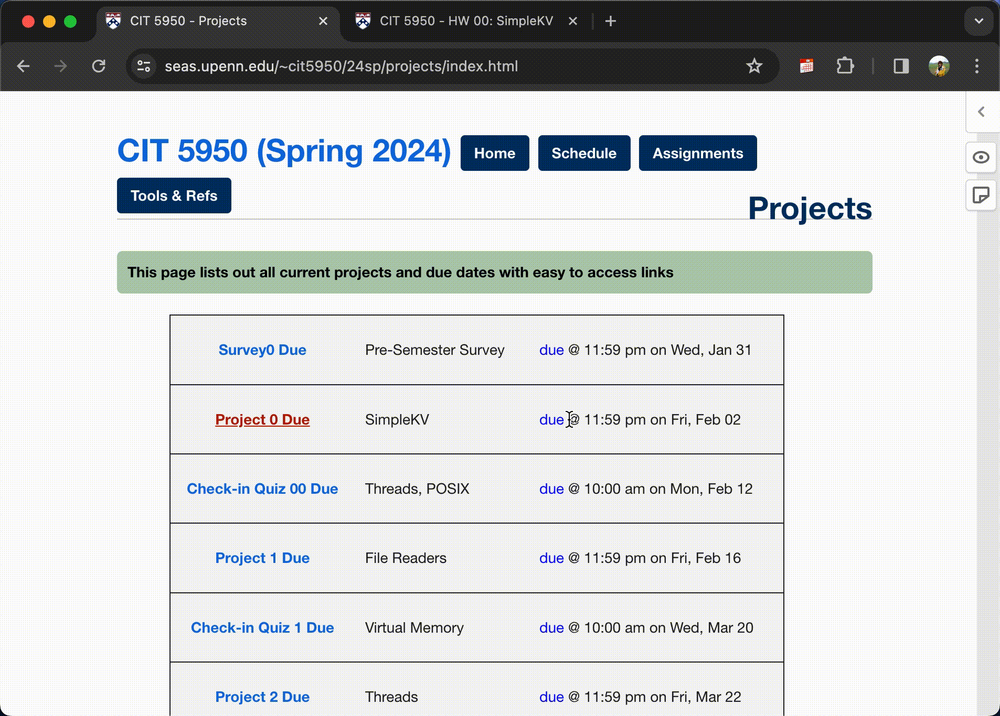

<!-- PROJECT LOGO -->
 

  

<h1 align="center">Task2Calendar</h1>

  

    A Chrome Extension helps clip assignment tasks from webpages to your calendars
  

<!-- ABOUT THE PROJECT -->
## About The Project

Task2Calendar is lightweight Chrome Extension tailored especially for UPenn MCIT students to clip assignment tasks from webpages directly to their calendars with a single click.

#### Built With

[![JavaScript][JavaScript]][JavaScript-url] [![HTML][HTML]][HTML-url] [![CSS][CSS]][CSS-url]

## Boost Your Productivity

#### Light - No need to deploy

<em>Summary Dashboard</em>

  
  

  <figcaption style="text-align:center"><em>Daily & weekly consumption summarized on main dashboard using a progress ring and an interactive bar chart</em></figcaption>

 

#### Simple - Easy to use

  
  

  <figcaption style="text-align:center"><em>Task2Calendar helps clip assignment from course webpage.</em></figcaption>

 

  
  

  <figcaption style="text-align:center"><em>Task2Calendar works with multiple types of webpage.</em></figcaption>

 

  
  

  <figcaption style="text-align:center"><em>When it comes to certain case that task name and due date aare not displayed on a single page, Task2Calendar allows the flexibility for user to add info manually.</em></figcaption>

 

#### Fast - Calendar automation

<em>Registration & Authentication</em>

    
    
    

<figcaption style="text-align:center"><em>User managed through Firebase Authentication</em></figcaption>

 

(<a href="#readme-top">back to top</a>)

<!-- Inspiration -->
## Inspiration

(<a href="#readme-top">back to top</a>)

<!-- ACKNOWLEDGMENTS -->
## Acknowledgments

This Chrome Extension was developed by Hao and Zairui for the productivity-boosting competition at the 2024 UPenn MCIT Hackathon.

(<a href="#readme-top">back to top</a>)

<!-- MARKDOWN LINKS & IMAGES -->
[JavaScript]: https://img.shields.io/badge/JavaScript-F7DF1E?style=for-the-badge&logo=JavaScript&logoColor=white
[JavaScript-url]: https://www.javascript.com/
[HTML]: https://img.shields.io/badge/html5-E34F26?style=for-the-badge&logo=html5&logoColor=white
[HTML-url]: https://html.com/
[CSS]: https://img.shields.io/badge/css3-1572B6?style=for-the-badge&logo=css3&logoColor=white
[CSS-url]: https://css3.com/